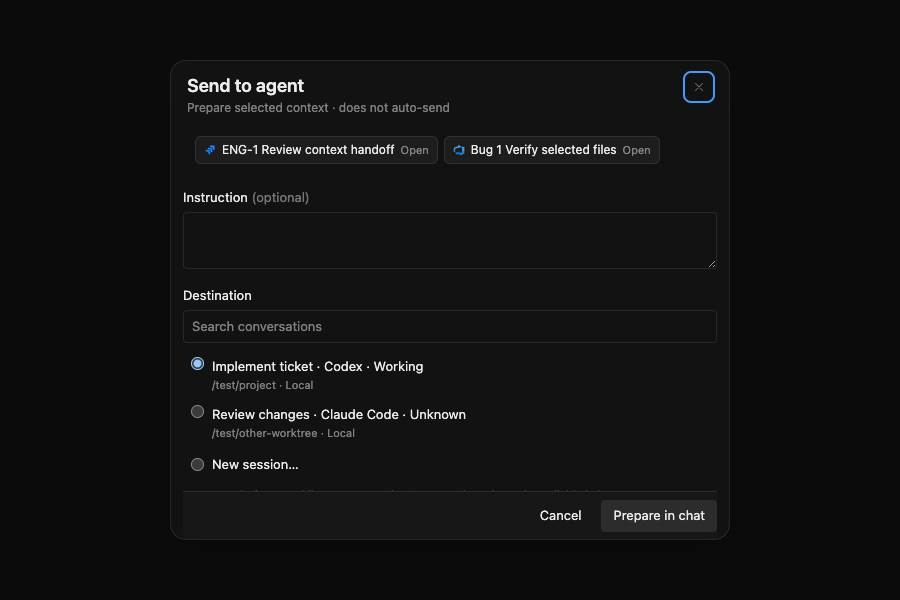
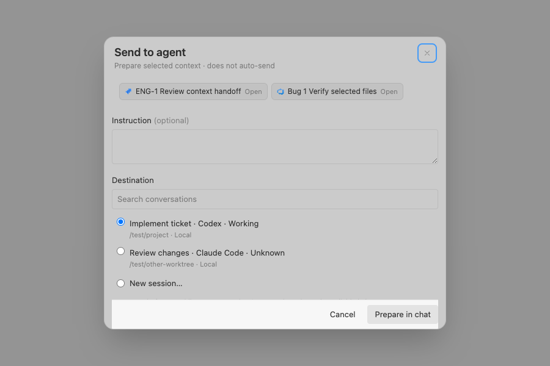

# Selected context (#8)

Use **Add to chat** for the owning conversation, or **Send to agent…** to review selected context, an optional instruction, and the destination. Preparation never submits a prompt. Existing destinations confirm in place with **Open conversation**; a fresh destination opens its prepared composer. The existing composer still owns send, queue and provider capabilities.

Inbox **Select tickets** preserves explicit selections across sources, filters and conversation navigation. Chips expand to show the included snapshot and provenance. Summary selection does not load ticket threads; the existing single-ticket context review can include selected richer details. Single GitHub ticket starts reuse persisted `linkedWorkItem`, badges and Inbox navigation. Multiple tickets do not replace the destination's existing link.

Text snapshots share a 32,000-character limit, with visible truncation. Bundles allow at most 20 entries and existing attachment limits (20 files / 20 MiB). File content is captured through native IO. Changed-file context contains selected before/after snapshots; the labels identify HEAD/index/working tree and capture time, not an atomic commit snapshot. Binary/oversized diffs fail visibly. Unsupported attachment recipients are disabled. Prepared context remains in memory like existing unsent composer cards; it is not restart-durable.

## Verification (2026-09-10)

- Latest `origin/main` at implementation base: `2aee4a79`. Included current upstream through `fe356a5` (image preview, line mentions and transcript review), retaining fork behavior.
- `npm run check:web`: 162 files, 1,552 tests and TypeScript passed. `npm run check:rust`: formatting, Clippy and 262 tests passed, one existing ignored test. Production `npm run build` passed with the existing large-chunk warning. One earlier web run was interrupted by prolonged timeouts; the unchanged rerun passed.
- Real macOS Tauri UI/IPC: Explorer file capture prepared the exact existing conversation. Live GitHub Inbox selection of #8 and #13 opened a fresh conversation with both chips; returning to Inbox retained both selected tickets and the count. No prompt was sent and no ticket was mutated.
- Browser component interaction: actual picker components at 900 × 600 in dark/light themes, destination selection, explicit existing-conversation navigation, and keyboard focus wrap. Automated component checks cover preparation failure, retained destination, repeat-click suppression, mixed-provider/account identity, source switching, bounded snapshots, deleted sources and unsupported attachments.
- GitHub account lookup was exercised against the active account. Linear viewer identity is tested in the parser. GitHub/GitLab add one lightweight account read per nonempty list response; Linear adds viewer ID to its existing query. If identity lookup fails, provenance explicitly says Account not reported; cross-account certainty is unavailable for that snapshot.

## Performance and remaining acceptance

On an Apple M5 Pro / 24 GiB Mac, minified production JS with 100 warmups and the median of 21 × 1,000 preparations of 20 ticket summaries measured 0.00685 ms for existing card preparation and 0.01091 ms for selected bundles. This excludes provider/network IO, WebView rendering, native app cost and agent/build processes. It is not an overall application benchmark. Hidden Inbox stops its foreground reads while retaining the mounted view; selected snapshots and lists are bounded.

Still unverified: real multi-provider/streaming agent interaction, live Jira/Linear/GitLab/Azure account switching, native changed-file/hunk interaction, Windows and Windows-to-WSL transfers. Background native screenshots remained on the boot splash, so screenshots below are explicitly browser component fixtures, not proof of full native rendering. Keep the PR draft until the required live acceptance is reviewed.

## Compact picker (component fixtures)

There was no recipient review sheet before this change; the existing Add to chat interaction remains the primary selection action.

