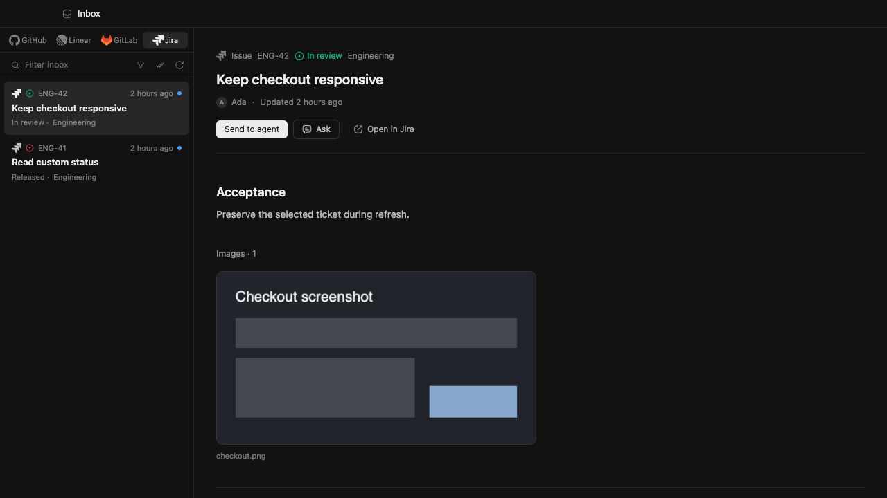
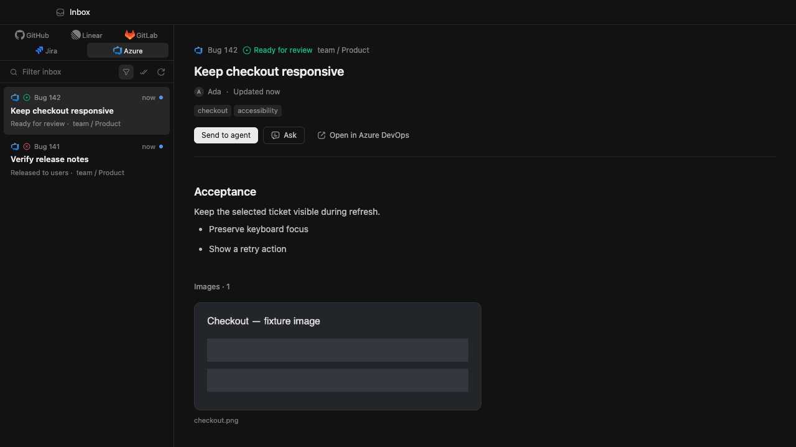
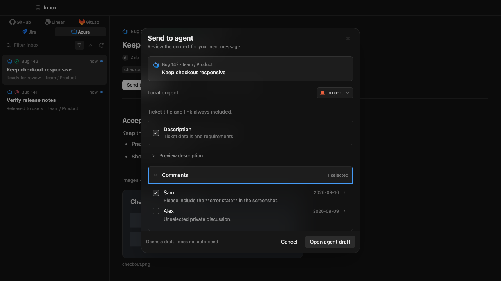

# Azure Boards Inbox

Issue [#12](https://github.com/kaceper11/monocode/issues/12). This is a read-only
Azure DevOps Services connector, not Azure Repos or Pipelines configuration.

## User flow

1. In Settings, connect Azure DevOps with `https://dev.azure.com/organization`,
   a default Boards project name, and an organization-scoped personal access
   token with **Work Items (Read)** and **Project and Team (Read)**.
2. Open Inbox → Azure. Assigned to me is the initial view. The existing filter
   popover selects projects and flat saved queries, remembers choices per
   organization, and controls which Inbox sources are visible.
3. Select a work item for its actual process state, description, latest
   discussion and supported image attachments. Refresh/search/unread/status
   controls remain the shared Inbox controls.
4. Ask or Send to agent opens the existing context dialog. Choose the local
   project explicitly for Send, then choose description, comments and files.
   Title, source identity and link remain included. Choices are retained by the
   existing account/item context storage and reused for Ask. Send opens a draft,
   not an automatic agent submission.

Failures stay local with retry/connection settings actions. A failed handoff
keeps the work item and local project. A failed refresh retains prior rows for
the current connection. Disconnect clears Azure detail caches and removes only
the local connection; it does not revoke the token at Microsoft.

## Boundaries and compatibility

- One active organization/account connection. Repos/Pipelines can reuse this
  connection later; neither is configured or inferred by Boards.
- Credentials use the existing app-host secret-file pattern: atomic replacement
  of `azure-config.json`, owner-only mode on Unix, and the app data directory.
  This is not an OS-vault migration. Windows relies on the profile directory's
  permissions and needs live verification. Tokens are never returned to the
  frontend or copied into WSL, prompts or URLs.
- No existing session/settings schema migration and no new dependencies.
  Organization/project/work-item identity remains separate from local Git and
  agent identity. No work-item state, comment or assignment writes are exposed.
- Services URLs only; legacy `visualstudio.com` and on-premises Server URLs
  are not supported by this slice.
- Lists are capped at 100 work items, fetched in one batch. Process metadata is
  fetched once per distinct project (at most 10), not once per rendered row.
  Unavailable state-category metadata is explicitly Unknown; the original
  readable state is preserved.
- The selector shows the first 100 projects and up to 100 flat saved queries,
  two folder levels deep. A project outside that list can be entered when
  connecting in Settings. Tree/link queries and normal-flow WIQL editing are
  not included.
- Details show 50 recent comments. Context can load up to five pages of 50.
  Rich text is converted in an inert template with bounded input/tree/output;
  unsupported markup does not execute or fetch external images.
- Supported same-organization Azure attachment links are membership-checked
  before authenticated download, without redirects. Image preview uses the
  shared gallery (2 MiB per image, up to 12 on demand), independently of context
  selection. Unknown image names/formats and unusual escaped links fall back
  to opening Azure. Arbitrary external attachments are not downloaded.
- Existing agent context limits remain 100,000 text characters, 20 files and
  20 MiB total. Files are sent only when explicitly selected.

## Local validation (2026-09-10)

- `npm run check`: 1,540 web tests; TypeScript; Rust formatting and Clippy;
  262 Rust tests passed, one existing test ignored.
- Targeted rerun after the URL-encoding edge-case fix: Azure normalization,
  rendered Ask/Send/retry, and Jira/Azure image tests passed.
- Real React views with sanitized IPC fixtures: source switching, search,
  saved query, refresh failure/retry, retained selection, unread action,
  context comment choices, failed handoff, settings failure/recovery and
  disconnect. Browser fixtures are not live provider acceptance.
- Final visual pass: colored marks in both themes; five-source switching and
  no source-label overflow with a 240 px Inbox list; keyboard opening of the
  context dialog and Escape returning focus to Send to agent.
- Fresh-agent review identified missing comment-only image previews. The fix
  carries attachments from the loaded discussion into the deduplicated gallery
  and revalidates comment membership before authenticated image fetch. Rust and
  rendered regression checks plus a browser fixture cover this path; the fresh
  reviewer approved the fix.
- Colored Jira/Azure marks reuse the shared provider-mark component. Assets are
  local Devicon SVGs, with attribution in NOTICE and the bundled
  `DEVICON-LICENSE.txt`; no runtime icon service or library.
- macOS native preview starts with a separate app identifier and data directory,
  leaving the installed app and Jira preview untouched.

Release-web build comparison on the same Mac17,9, 24 GiB RAM, macOS 26.6.2,
Node 22.23.2: the main chunk changed from 2,924.06 kB / 882.15 kB gzip at
`e83147c` to approximately 2,938 kB / 886 kB gzip. This is a bundle-size
observation, not an app CPU, memory or interaction-latency benchmark. Existing
large-chunk warnings remain. Azure adds no polling loop or disconnected Boards
requests; list and HTTP work run off the interactive thread.

Base: merged Jira PR #50 at `e83147c`. Upstream was inspected through
`fe356a5`; its newer session-review/transcript changes do not supply a Boards
connector. No unrelated upstream merge is included.

### UI evidence

Sanitized browser fixtures, 1280 × 720, dark theme: the existing Jira detail
before this slice and Azure in the same shared Inbox afterwards.

### Still unverified

Authorized live Azure Services reads, real attachment downloads, expired-token
and missing-scope service responses, two real organizations with colliding
IDs, Windows UI → WSL agent handoff, the richer repository/base/worktree kickoff,
mixed-provider delivery through future Repos/Pipelines connectors, and
responsiveness while a real agent streams. No credentials or Windows/WSL test
host were used for this slice. The user authorized merging and closing the
issue after the reviewed fix and local checks. That delivery decision does not
turn fixtures, native startup or a hosted build into live acceptance evidence.
