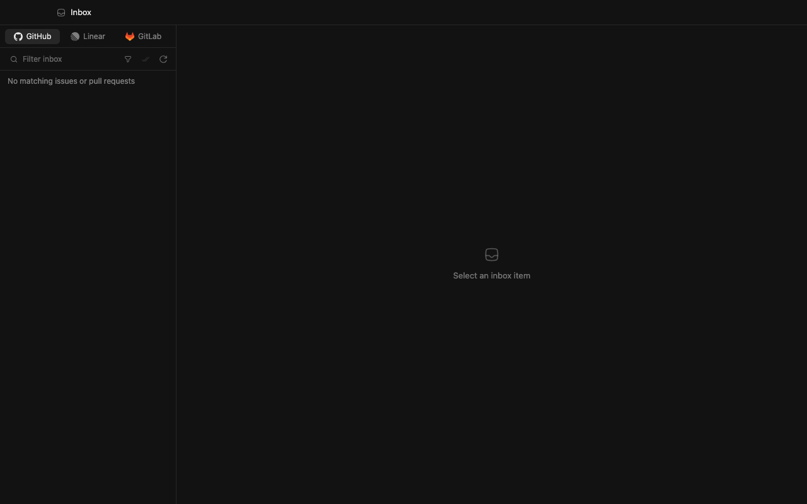
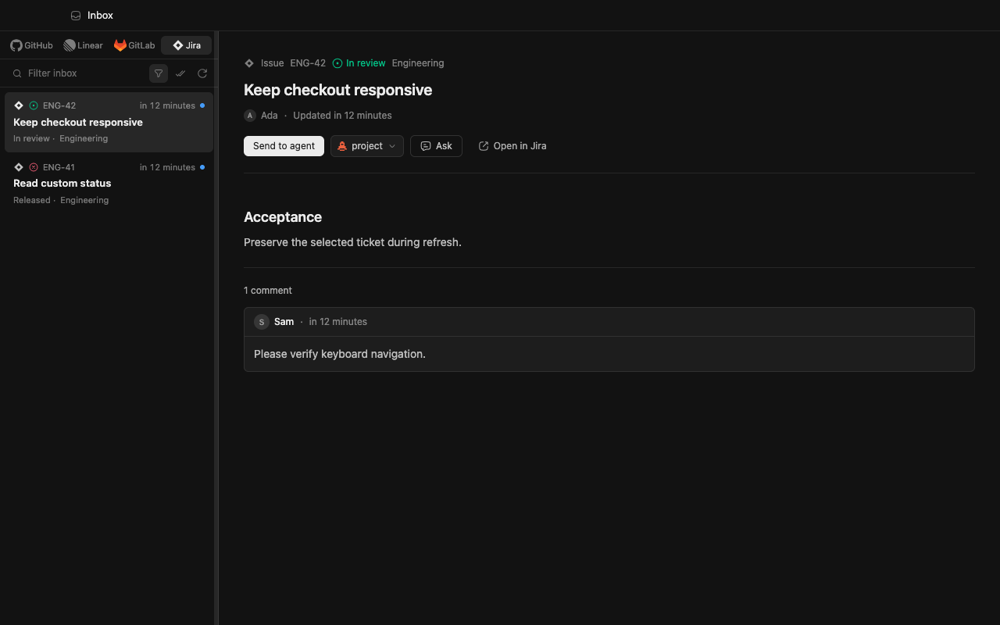
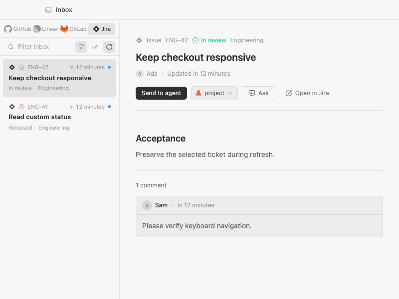
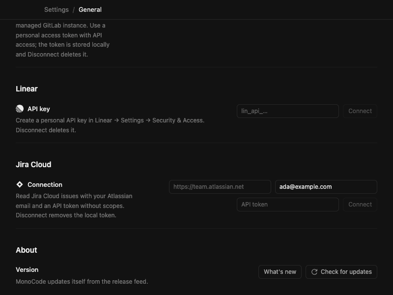

# Jira Cloud Inbox

Connect in **Settings → General → Jira Cloud**, then choose **Jira** in the existing Inbox. The default is **Assigned to me**. The existing filter popover offers friendly project and favorite-filter names, remembers the site-specific selection, and combines it with text, time and open/closed filters. Jira's actual status remains visible on cards and details.

Select a ticket to load its description/comments. **Send to agent** uses Linear's explicit local-project chooser and prepares a fresh conversation's existing composer card; the user reviews and sends it. **Ask** uses the existing Inbox conversation flow. **Open in Jira** opens the original ticket. Imported content is untrusted reference data. No Jira comments, transitions or assignments are written. Failed handoff retains the selected ticket/project; read errors offer local Retry. Jira never determines the Git, PR, CI or agent provider.

## Connection and limits

- This slice supports one `https://<site>.atlassian.net` Cloud account, using Atlassian email and an API token **without scopes** with the [documented direct-site Basic authentication route](https://developer.atlassian.com/cloud/jira/platform/basic-auth-for-rest-apis/). Scoped gateway tokens, OAuth and Server/Data Center are not implemented. Use a dedicated account with only the project-reading permissions needed; an unscoped token is not itself a read-only credential, even though this connector only calls GET endpoints.
- The token stays in the app host's `jira-config.json`, using GitLab's existing secret-file writer (0600 on Unix, application-data storage on Windows). It is not returned to the WebView, cached in browser storage, logged, or included in service errors. This is file-based storage, not a new encrypted vault. Disconnect deletes the local credential, not the remote token; revoke it in Atlassian when needed. No other installation's credentials are read or migrated.
- Calls run off the interactive thread, disable redirects, time out after 20 seconds and cap responses at 2 MiB. Search uses [enhanced JQL pagination](https://developer.atlassian.com/cloud/jira/platform/rest/v3/api-group-issue-search/) with at most 100 issues/10 pages. Project/favorite choices are also capped at 100. Narrow the filter if needed; no normal-flow JQL entry is required.
- Details are on demand, bounded to 40 cached tickets/threads. Comments include the newest 50 with an explicit truncation notice. ADF conversion supports common text, lists, links, code, quotes and readable tables, bounded to 64k output characters, 10k nodes and depth 32. Attachments remain placeholders and are never downloaded.
- Jira joins the existing Inbox cache and refresh lifecycle, with generation guards against stale responses after disconnect/filter changes. There is no new polling process. Rate limits/service errors pause requests for 1–300 seconds (Retry-After, otherwise 30 seconds). Other providers retain their cards and local errors. GitHub/GitLab deduplication now includes provider identity so matching repository/issue numbers cannot hide a card.
- No existing schema changes or migration. Disconnect/reconnect recovers invalid credentials; saved filters contain only site and numeric project/filter IDs.

## Validation for #11

Local `npm run check` passed: 1,520 web tests and 258 Rust tests (one ignored), including Jira pagination, custom states, site/project identity, favorite selection, ADF bounds, secret-free failures, disconnection races and a rendered Inbox handoff/retry test. `npm run check:web` and production `npm run build` were repeated after the final shared-key change.

Real React Inbox/Settings components were exercised in a browser with a mocked native bridge and fictional Jira data: all four sources, search/filter persistence, unread/mark-all, selection after switching/refresh, disconnected/empty/loading/error/retry, masked connection/disconnect, explicit local-project selection and failed handoff. Other-provider navigation remained interactive during a pending Jira refresh. Mouse and keyboard checks included source focus and moving to search. The minimum 240px list keeps all four source labels within their cells. These checks are not native-app or live-service acceptance.

Before/after Inbox images use the same 1280×800 dark viewport; the compact light image uses 800×600 with the minimum-width list. Settings reuses adjacent Linear/GitLab rows at 800×600. Screenshots contain fictional data.

### Performance, compatibility and remaining acceptance

On Apple M5 Pro/macOS with Node 22.23.2, the production frontend main chunk changed from 2,891.71 kB (gzip 876.13 kB) at `840ed4c` to approximately 2,903.22 kB (gzip 875.90 kB). Existing large-chunk/dynamic-import build warnings remain. No dependency was added. This is bundle measurement, not app speed.

A development microbenchmark of minified affected JS (1,000 warmups, median of nine 1,000-call batches) measured filtering 100 GitHub items at 0.0134 ms before / 0.0122 ms after, and converting roughly 50k characters of Jira ADF at 0.0263 ms. These are Node-only measurements, not native/WebView/backend/network/agent costs; small differences are noise. Native release memory/CPU and responsiveness while a real agent streams remain unmeasured.

Upstream was checked through `8371181`; its newer image-preview change does not supply Jira browsing. Existing Inbox cards, filters, markdown, unread state, Settings rows, Ask and Linear handoff patterns were reused rather than replaced.

Still **unverified**: authorized Jira Cloud retrieval/auth/permissions and live handoff; native Windows credential behavior; Windows UI → WSL project/agent context; Jira + Azure Repos/Pipelines delivery; native streaming responsiveness. No authorized account or Windows/WSL test host was supplied. Full repository/base/branch/worktree/existing-session kickoff and persistent linked-session parity remain the shared #8/#32 integration, not a duplicate Jira implementation. This PR delivers #11's permitted read/handoff slice and does not close the entire issue's acceptance.
