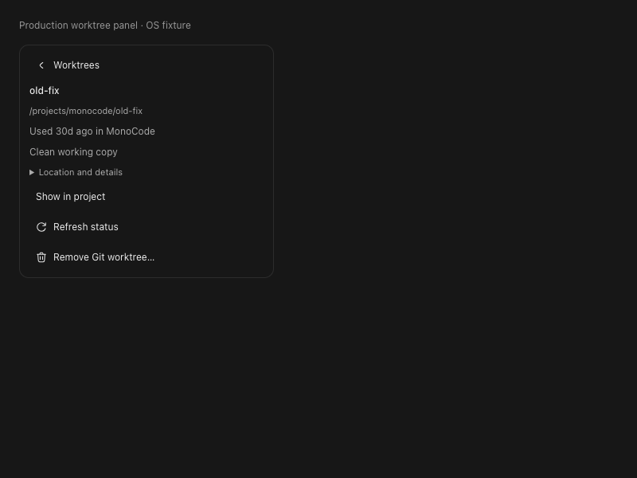
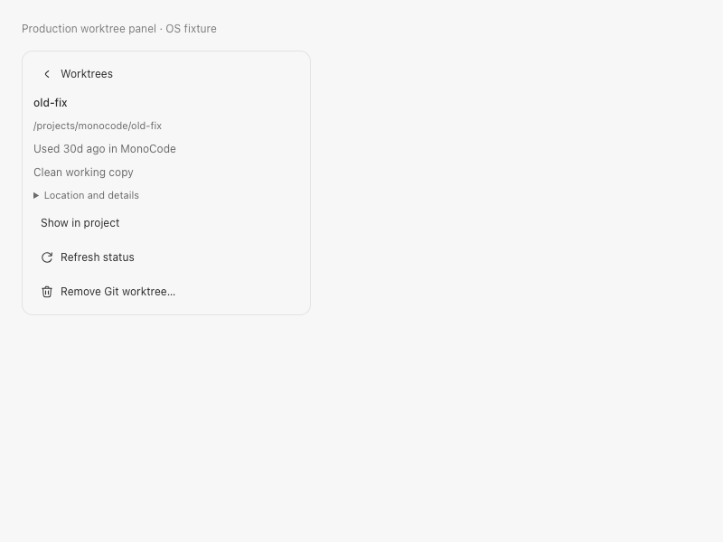

# Local worktrees

Open the composer **branch picker**, then **Worktrees**. Search existing checkouts
or type a new name and choose **Create worktree**. Arrow keys and Enter select a
result. Creation starts from the current branch; the **From** row changes the base.
The plus action beside a branch opens creation with that base selected. Git supplies the inventory,
including externally created checkouts. Select an explicit local or remote-tracking
ref, review its commit, and enter a new branch name. The suggested folder can be
changed by clicking the folder row. **Create branch and worktree** creates both together and opens a fresh
conversation after Git confirms creation; it does not dispatch an agent. A later
dispatch failure does not recreate or remove the worktree. Remote refs are cached:
fetch with Git and refresh explicitly.

Each conversation keeps its persisted working directory and provider session.
Opening another worktree creates another conversation, including from an empty
conversation. Existing terminals retain their original directory. Recent saved
conversation associations are shown (up to 100 per checkout); explicit reuse warns
about concurrent writers. Unsaved empty conversations and external processes are
not a complete inventory of writers.

Removing a worktree requires an in-app confirmation and fresh Git validation.
The main checkout, detached HEAD, locked/prunable/missing entries, changed HEAD,
symlink aliases, dirty, untracked and ignored files are rejected. Branches and
conversation records are retained. Closing, archiving or deleting a conversation
does not remove its checkout. Pruning metadata, deleting branches and repairing
missing directories remain explicit Git operations, with no automatic retry.

Cleanup conservatively requires all this app's agent processes and terminals to
be closed, even those in another repository. Process startup is serialized against
removal. External editors/agents are outside the app's ownership; stop them before
cleanup. Git still enforces its non-force removal safeguards. Operations have a
30-second Git timeout and retain at most 1 MiB from each pipe. A timeout is an
uncertain result: refresh and inspect the exact path/branch before retrying.

## Runnable acceptance

Use only disposable repositories; do not run cleanup scenarios on real work.

1. Initialize a repository with a commit and two branches at distinct commits.
   Add a remote-tracking ref with `git update-ref refs/remotes/test/topic <commit>`.
   Create worktrees from each selected ref, including a path with spaces/Unicode.
   Confirm `git -C <path> rev-parse HEAD` matches the displayed commit.
2. Add another checkout externally with `git worktree add -b external <path>`.
   Refresh, open it, and switch back to a previous conversation. Read/edit a fixture
   and inspect Changes in each checkout; no other checkout should change.
3. Start a bounded agent read and a terminal. Open another checkout. Confirm their
   directories remain unchanged. Quit/reopen and reopen the saved conversation;
   verify its transcript, directory and provider identity survive.
4. Preview removal with an open terminal: confirm rejection without stopping it.
   Close owned processes, then test tracked edits, untracked files and ignored
   `.env` files. All must remain intact. Test locked and detached checkouts too.
5. Remove a clean unused checkout after reviewing its exact path and HEAD. Verify
   its branch still exists and saved conversations remain. Delete a disposable
   checkout externally and refresh: show missing/prunable state without pruning.
6. Try duplicate branch/path names, a base ref moved after selection, two repositories
   with the same branch names, repeated clicks, cancel before confirmation and a
   failed create. Refresh must reconcile actual Git state without a duplicate.

Run regression checks with `npm run check`. The release measurement is
`cargo test --release inventory_release_measurement -- --ignored --nocapture`.
It measures production inventory logic against 11 disposable worktrees, without
agents or UI rendering. It is not an app responsiveness or WSL benchmark.

Native Windows interaction and Windows-to-WSL acceptance remain unverified on this
Mac. #22 extends this local boundary; ticket kickoff follows #6/#8 and each
connector. Neither live WSL nor the full ticket/provider matrix is claimed here.
# Project hierarchy revision (September 9)

The project rail now groups existing recent paths only after Git proves that
they share a canonical common Git directory. Independent clones remain separate.
Original recents, labels, pins, ordering and session paths are retained; the
navigation grouping is a recoverable projection, not a destructive migration.
Unavailable paths remain visible independently. Expanded state and the last
selected working copy are saved per repository family.

Use the parent row's **New worktree** button. The existing popover now opens
directly at Repository, Base, Branch and Location, with an editable unused branch
suggestion. Child rows select the exact checkout through the existing session
selection path. The same verified grouping feeds the compact project selector.

Native macOS smoke: a disposable repository with an external Unicode-path
worktree was opened; two further worktrees were created using the parent button,
both appeared under one parent, and selecting the external child changed the
visible branch to its own branch. Disclosure and parent last-used selection
were exercised. These checks do not establish multi-agent, terminal, restart,
Windows or WSL acceptance of the expanded hierarchy requirements.

Release backend measurement on Apple M5 Pro / 24 GiB / macOS 26.6.2, 11 working
copies and 21 calls: inventory median 12.97 ms, maximum 24.08 ms; verified family
median 38.15 ms, maximum 49.94 ms. Family verification includes two extra Git
identity calls. It runs off the UI thread, reuses sibling inventory evidence and
has no timer-based polling. These numbers exclude WebView and agent costs.

## Activity and cleanup

Use the child's **…** button, or Branches → Worktrees. **Oldest first** orders known MonoCode activity; unobserved external worktrees remain **Activity unknown**. The timestamp is the latest saved conversation update or recent project open, not a claim about external editors, commit age or deletion safety. Main and active working copies remain protected.

The compact details show activity and on-demand file/process blockers. **Hide from project** changes only a bounded presentation preference; **Show in project** restores it from the same list, including after restart. Sessions, original recents/labels and Git metadata remain intact. Hidden children remain discoverable in the worktree list. The existing parent menu handles archiving the main/final project association.

**Remove Git worktree…** requires an explicit path/branch/HEAD confirmation and the existing fresh backend checks. Dirty, untracked/ignored files, locked/missing entries and running app processes block removal. No branch deletion, force removal or automatic aging cleanup is added. Missing children expose **Location and recovery** and **Retry**: restore the original folder or explicitly repair Git registration from a surviving checkout. Repair does not guess a new session path or rewrite history.

The rail and branch worktree panel share published Git inventory. Session activity is loaded only when the worktree panel opens, retaining at most 100 users per checkout. Sidebar discovery does not query conversation history; it can show known recent-open times. File/process status is fetched only for the selected detail, not polled per row. The effective session checkout is `worktree_cwd` when present, otherwise `cwd`; it is not attributed to both.

Native disposable-repository checks exercised hide/restore, dirty removal refusal and confirmed clean removal with branch and sibling files retained. Production component fixtures at 800×600 exercised known/unknown age ordering, persisted hiding, keyboard focus and dark/light rendering; only the OS boundary was substituted. Full authenticated concurrent-agent and Windows/WSL acceptance still requires the corresponding real-platform scenarios. Tests and UI fixtures do not certify those boundaries.

