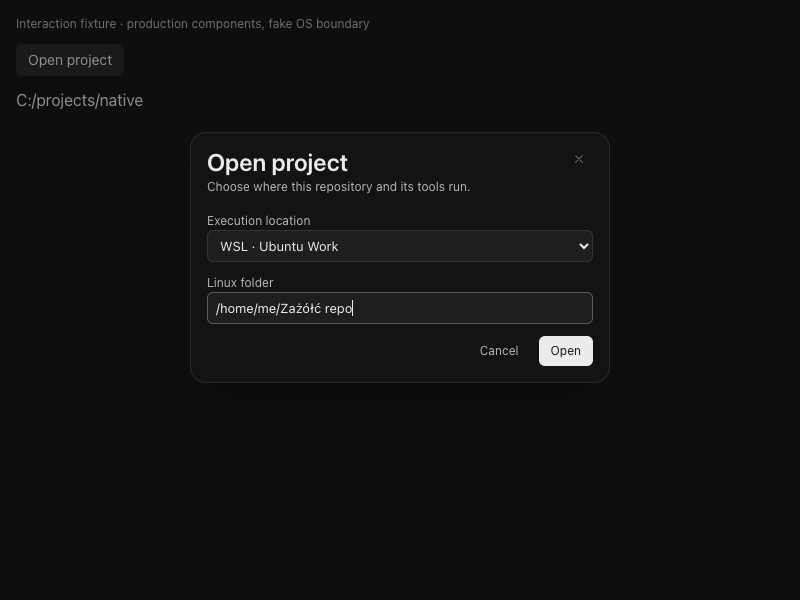
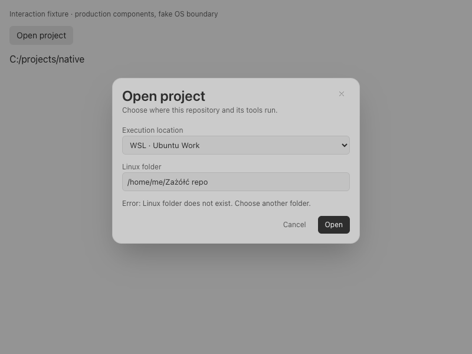

# Windows UI with WSL execution (#22)

**Draft implementation; awaiting live Windows-to-WSL acceptance.** Mac fixtures exercise the production routing, Git/filesystem helper and agent supervisor. They do not prove WSL interoperability. Native Windows CI is configured but currently cannot start because of the repository account's Actions restriction.

## Opening a project

From Projects → Open project (or the existing File menu), Windows users choose **This Windows PC** or **WSL · distribution**. Native projects use the stock folder picker. WSL projects accept an absolute Linux folder, validate it in that distribution, and open the ordinary workspace. The current project's distribution/path are prefilled on subsequent opens. Errors preserve those values; Cancel ignores a late connection result.

The WSL badge beside project/composer identity opens connection details and Reconnect. Branch/worktree creation uses the existing branch controls and displays Linux destination paths. Files, Changes, search, terminals and agent chat keep their existing surfaces.

Internal saved paths carry distribution identity. Linux filename case is retained. There is no session-schema migration, credential copying or Windows fallback. Existing native sessions stay native. Selecting a different distribution is an explicit project selection.

## UI fixture evidence

These 800×600 Chromium captures render the production React components with only Tauri/OS calls substituted. Selection, Unicode paths, retry with retained values, cancellation of a late result, Tab/Shift-Tab containment and Escape/focus return were exercised. The final accessibility audit reported zero violations; transparency prevented automatic contrast determination for some modal content, so contrast is not claimed fully certified. This is not a Windows WebView or live WSL result.




## Runtime and limits

- WSL 2, Python 3.9+, Linux Git and GNU `mv` are required. Agent cancellation also requires Linux pidfd support. Install/authenticate agent CLIs and optional `gh` inside the selected distribution.
- New connections validate the selected path/Git before registration. Failed initial opens release their process and slot; a bad path on an existing host preserves that connection. Watchdog expiry marks the connection dead even if a response races the timeout; reconnect creates a fresh bridge, and interrupted mutations remain uncertain.
- A maximum of four app-open Python stdio bridges handle filesystem/Git work. No service, socket or scheduled automation is installed. Requests have a 30-second deadline; pending requests are capped at 32 and 64 MiB of encoded data. Each message is capped at 40 MiB. Interrupted mutations are not retried automatically.
- Metadata/read requests are batched (up to 64 files); search reads 16 files per batch, at most 512 KiB each. Directory listings are capped at 20,000 entries. Git subprocess output is capped at 8 MiB per pipe and runs for at most 25 seconds.
- Checkpoint capture, comparison and undo read/write through Linux; saved snapshots remain in the app profile. Linux names are encoded for case-sensitive, Windows-safe storage; existing native snapshots are unchanged. The existing 500-file snapshot cap and 8 MiB file limit remain. Project/user skill discovery scans at most 2,000 entries and 300 skills per root, reading at most 16 KiB per skill; creating a user skill resolves the Linux home.
- Explicit native attachments transfer sequentially to a private Linux temporary directory, at most 20 MiB per file, 64 distinct files/128 MiB per bridge. Repeated identical attachments reuse the file. Another distribution's attachments require an explicit transfer outside this flow. Temporary attachment paths are not durable resume data after reconnect/app exit.
- Agents use separate streaming subprocesses, not the filesystem request queue. Startup waits for an acknowledgement before launching the provider. Cancellation checks distribution boot identity and process start time, signals through a pidfd, and waits for the supervisor to terminate its Linux process group. At most four cancellation launchers run concurrently during shutdown.
- Agent output lines are limited to 32 MiB. Frontend startup/event buffers retain at most 1,000 entries/64 MiB per session. The existing ConPTY terminal stream keeps its bounded reads/coalescing.

## Explicit remaining boundaries

- **No live Windows/WSL result is claimed.** Distribution shutdown, Windows/ConPTY hangup/job control, concurrent native/WSL agents, credentials, approval recovery and Windows networking still need the scenarios below.
- OpenCode's HTTP/SSE transport is explicitly unavailable for WSL. Use a stdio provider such as Claude or Codex. Native OpenCode remains available. WSL model menus use bundled models; Windows-discovered catalogs are not evidence of Linux account/model availability. Linux CLI installation/authentication and provider-specific resume must be accepted live.
- Claude installed-plugin registry skill discovery is not implemented for WSL; fixed project/user skill directories are supported.
- Browsers open on Windows. MonoCode does not forward ports; localhost access depends on Windows/WSL networking configuration. Run Linux editors from the terminal. Reveal in Explorer uses an explicit WSL path, after Linux validation.
- This is an app-open runtime. Normal cancellation attempts Linux cleanup; abrupt Windows termination, app crashes or descendants surviving a provider's ordinary exit may leave work requiring inspection inside Linux. Durable supervision is #21, not implied here. Reconnect restores access, not a promise that an interrupted agent turn completed.
- The compact activity/cleanup controls from #38 are included: known/unknown MonoCode activity, oldest-first sorting, reversible hiding, on-demand Linux safety checks and confirmed Git removal. Full concurrent-agent and cross-platform hierarchy acceptance remains separate.

## Runnable live acceptance

Record Windows version, `wsl --version`, `wsl --list --verbose`, distribution release/kernel, Python/Git/CLI versions and the tested MonoCode commit. Use two disposable Linux repositories and one disposable native Windows repository. Do not test cleanup on user worktrees.

In each selected Linux distribution, prepare a fixture:

```sh
fixture=$(mktemp -d -t monocode22-XXXXXX)
mkdir "$fixture/repo space ż"
cd "$fixture/repo space ż"
git init -b main
git config user.name 'MonoCode fixture'
git config user.email fixture@example.invalid
printf 'before\n' > 'hello ż.txt'
git add . && git commit -m baseline
printf 'after\n' > 'hello ż.txt'
printf '%s\n' "$PWD"
```

1. Open project → choose the first distribution → enter the printed Linux path. Confirm the badge, `main` branch, Unicode filename and before/after diff. Stage/unstage that file; verify the Linux Git index, not the Windows repository. Repeat at 800×600 in light/dark themes, using mouse and keyboard. Check Tab containment, Escape/focus return, empty/error states and no clipped controls.
2. From the branch/worktree controls, create a new branch and worktree from an explicitly selected ref/commit. Confirm one repository family, the selected working copy, Linux location and session association. Create a second child; switch away/back and restart the app. Verify selection and session resume remain bound to the same distribution/worktree.
3. Start an authenticated Linux Claude/Codex agent in the child. Ask it to create `acceptance.txt`, report `pwd`, `uname`, and `git status --short`, and run a harmless project test. Verify file/diff/staging in the ordinary UI. Attach a native Windows text/image file and a Linux file; confirm the agent sees the intended bytes and Linux paths. Record the actual Linux account/config; do not print tokens.
4. Before agent edits, leave a user change in a separate file. Inspect the session diff, undo the agent change and verify the user change remains; repeat with an agent-created Unicode file and case-distinct Linux filenames. Discover/create a project and user skill and verify their Linux paths. Leave an approval pending, switch to a native Windows repository and run an independent agent/terminal. Return to WSL and approve/deny once. Confirm no replay or cross-host response. Cancel a running WSL agent (including a child server) and inspect Linux processes. Retry cancellation errors explicitly; never assume a failed cancellation stopped work.
5. In a WSL terminal, run `pwd`, `uname -a`, `git status --short`, Unicode output and a foreground `sleep 30`. Resize, Ctrl-C, start/stop a background job, close the pane and inspect remaining processes. Exercise noisy output while another agent streams; record backend, WebView and agent CPU/RSS separately.
6. Repeat with the second distribution and same Linux path/branch names. Stop only the disposable test distribution with `wsl --terminate <distribution>`. Confirm a clear disconnect, preserved intended path and no Windows fallback. Reconnect once; test a deleted/missing project path, failed Git/CLI prerequisite and cancellation during connection.
7. Read an existing authorized GitHub issue/PR/check using Linux `gh`; confirm Linux credentials. New external comments/PRs require their own explicit authorization. Jira/Azure acceptance follows their connectors. Record unsupported operations, especially OpenCode HTTP.
8. Start a harmless Linux dev server and test Windows browser access with the machine's actual WSL networking mode. Record whether localhost forwarding works; no automatic forwarding is promised. Test explicit Explorer reveal and Linux-terminal editor opening.
9. In the disposable linked worktree, attempt removal while an agent/terminal runs, with changed HEAD, with tracked/untracked/ignored changes, and while locked. Confirm refusals preserve every file/process. Close processes and clean only the fixture; verify safe removal without branch deletion. Record the still-pending #32 UI boundaries separately.

Attach screenshots, commands/results, tested commit and remaining failures to draft PR #40. Keep it draft until required acceptance is reviewed; do not infer acceptance from unit tests or compilation.

Force cleanup inherits the explicit two-step confirmation from #38. The bounded filesystem fingerprint runs inside Linux through the existing bridge; Windows never walks a WSL tree. Rust revalidates the distro-qualified Git family, path, HEAD and index, and rejects changed file evidence before invoking Git removal. The Linux scan caps 10,000 entries, 64 MiB, 25 seconds and 100 displayed names. Running app processes still block cleanup conservatively; no implicit process stopping or stale-registration pruning is performed.

Additional production-boundary regression checks cover dirty Linux force-review refusal, changed-content rejection, fresh confirmed removal and branch preservation; concurrent bridge requests preserve their responses, and requests blocked behind a disconnected bridge fail without writing files. Native/Ubuntu/Debian paths with the same Linux suffix remain distinct repository families. These fixtures do not establish live Windows/WSL acceptance. Add force-cleanup checks to the disposable worktree scenario above, including a live Linux agent/terminal blocker and a file changed after preview.
